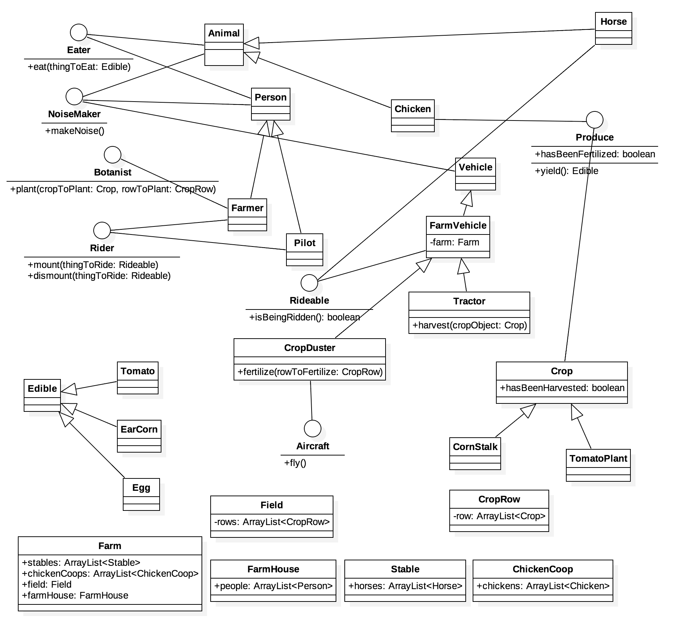

# Ol' McFroilan Had a Farm
* **Objective:** To implement a system indicative of a Farm environment
* **Purpose:** To demonstrate [multi-inheritence design issues](https://www.geeksforgeeks.org/java-and-multiple-inheritance/)
* **Prerequesites:** A `UML` approved by an instructor.

# Setting the Plot...

* Consider a system in which
	* `Eater` can `eat` an `Edible `object.
	* `NoiseMaker` can `makeNoise`
	* `Animal` is a `NoiseMaker` and `Eater`
		* `Horse` is an `Animal` and `Rideable`
		* `Chicken` is an `Animal` and a `Produce` which `yield` an `Egg`.

	* `Rider` can `mount` and `dismount` a `Rideable` object.
	* `Botanist` can `plant` a `Crop` in a `CropRow`.
	* `CropRow` can store a single row of `crop`.
	* `Field` can store many `CropRow`
	* `Vehicle` are `NoiseMaker` and `Rideable`
		* `FarmVehicle` can `operate` on a `Farm`
			* `Tractor` is a `FarmVehicle` which can `harvest` a `Crop`.

		* `Aircraft` are `Vehicle` which can  `fly`
			* `CropDuster` is a `FarmVehicle` and `Aircraft` which can `fertilize` a `CropRow`

	* `Produce` can `yield` an `Edible` object depending on their `hasBeenFertilized` [flag](https://en.wikipedia.org/wiki/Boolean_flag).
		* `Crop` is a `Produce` which can `yield` an `Edible` object depending on its `hasBeenHarvested` and `hasBeenFertilized` flag.
			* `CornStalk` is a `Crop` which can `yield` a `EarCorn`
			* `TomatoPlant` is a `Crop` which can `yield` a `Tomato`

	* `Person` can `makeNoise` and can `eat` an `Edible` object.
	* `Farmer` is an `Eater`, a `Rider`, a `Botanist`, and a `Person`.
	* `Stable` stores many `Horse`.
	* `FarmHouse` stores many `Person`
	* `ChickenCoop` stores many `Chicken`
	* `Farm` stores many `Stable`, many `ChickenCoop`, and a single `FarmHouse`

# Establishing The Plot

* `Froilan`, a `Farmer` has a `Farm` consisting of
	* 1 `Field` of 5 `CropRow`.
		* Row 1 has `Corn`
		* Row 2 has `Tomato`
		* Row 3 and beyond grows arbitrary vegetation.

	* 15 `Chicken` across 4 `ChickenCoop`
	* 10 `Horse` across 3 `Stable`.
	* 2 `FarmVehicle`
	* 1 `Aircraft`
	* His sister, `Froilanda`, is a `Pilot` who uses a `CropDuster`.

# The Plot Thickens...
* Create a test cases which simulate a typical work-week for `Froilan` and `Froilanda`.
	* The accumulation of your test cases should ensure at least 80% test coverage.

* The first few weekdays have already been considered for you.
* Create a separate Test class for each day in the following scenario.
	* As a farmer, Froilan must stick to a rigorous agricultural routine.
		* Every morning, `Froilan` and `Froilanda` begin their morning by
			* Riding each `Horse` in each `Stable`.
			* Feeding each `Horse` 3 ear of `Corn`.
			* For breakfast,
				* `Froilan` eats 1 `EarCorn`, 2 `Tomoato`, and 5 `Egg`.
				* `Froilanda` eats 2 `EarCorn`, 1 `Tomoato`, and 2 `Egg`.

		* `Sunday`, `Froilan` plants 3 different type of `Crop` in his first, second, and third `CropRow`.
		* On `Monday`, his sister, `Froilanda` uses the `CropDuster` to `fly` over the `Field` and `fertilize` each of the `CropRow`
		* On `Tuesday`, `Froilan` uses his `Tractor` to `fertilize` each `Crop` in each `CropRow`.
